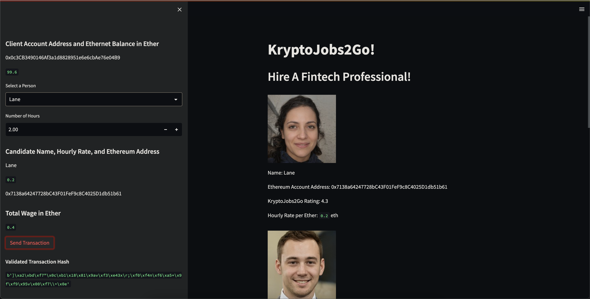
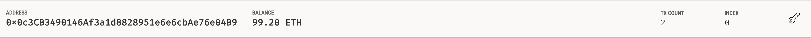
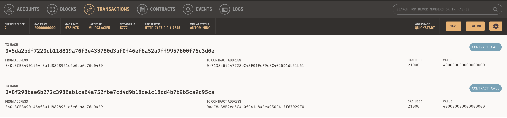
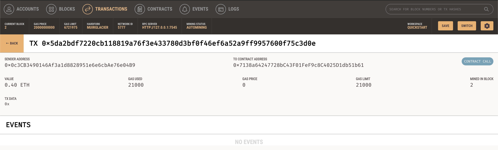
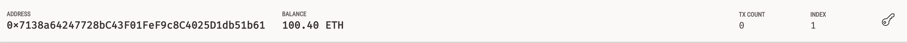
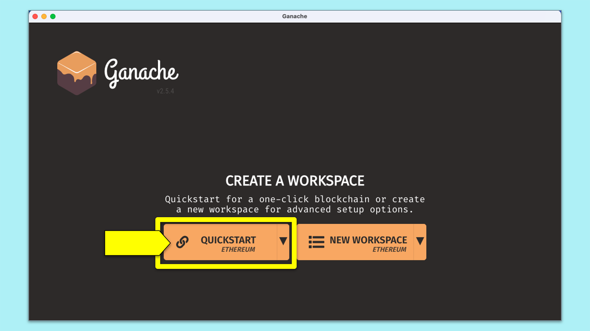

# Cryptocurrency Wallet


You’re a fintech engineer who’s working at one of the five largest banks in the world. You were recently promoted to act as the lead developer on their decentralized finance team. Your task is to build a blockchain-based ledger system, complete with a user-friendly web interface. This ledger should allow partner banks to conduct financial transactions (that is, to transfer money between senders and receivers) and to verify the integrity of the data in the ledger.

## The Application

Here we can see the application up and running. On the right-hand side we can see the FinTech Professionals as well as their ethereum address and hourly rate in ethereum. On the left-hand side we can see our ethereum account address as well as our balance in ETH. Below this is a form to select the FinTech Professional by name, as well as how many hours we would like ot hire them for. Below the form we can see their name, hourly rate and ethereum address, as well as the total wage in ETH which is calculate by multiplying the hours by the hourly rate. Below this is a transaction button that when clicked transfers ETH from the users address to that of the FinTech professional and outputs a validated hash from the transaction.




## Transaction on Ganache

Here we can the senders address, their balance in ETH, the amount of transactions they've done as well as their index location.


Here we can see the transaction history which shows the transaction hash, the to and from addresses, the gas limit and value that was sent in the transactions.


On closer inspection of the latest transaction we can see the transaction hash, teh to and from address, the value in ETH, the gas price, the gas limit, the mined block and tx data.


Here we can the revievers address, their balance in ETH, the amount of transactions they've done as well as their index location.


## Getting Started

### Prerequisites

Download Ganache [here](https://trufflesuite.com/ganache/)


You must have Python 3 & Pip installed

```
$ python3 --version
Output: Python 3.10.8
$ pip --verison
Ouput: pip 22.2.2 from /Users/{#Username}/opt/anaconda3/lib/python3.9/site-packages/pip (python 3.9)
```

### Installing Dependencies

```
$ pip install streamlit
$ pip install python-dotenv
$ pip install datetime
$ pip install pandas
$ pip install typing
$ pip install dataclasses
$ pip install bip44
$ pip install mnemonic
$ pip install eth-tester
$ pip install web3
$ pip show protobuf
$ pip install --upgrade protobuf
```

### Clone Repository
```
$ git clone git@github.com:SZun/Cryptocurrency-Wallet.git
$ cd PyChain-Ledger
```

### Open Ganache Workspace



### Run The Application
```
$ streamlit run krypto_jobs.py
```

## Built With
[]([https://www.python.org/downloads/release/python-3713/)
[](https://www.python.org/downloads/release/python-3713/) - *Programming Language* <br>
[](https://streamlit.io/) - *Web app generation tool* <br>
[](https://pandas.pydata.org/docs/#) - *Data analysis library* <br>
[Requests](https://requests.readthedocs.io/en/latest/) - *HTTP Library* <br>
[Python-Dotenv](https://github.com/theskumar/python-dotenv) - *Environment variable helper library* <br>
[BIP 44](https://github.com/bitcoin/bips/blob/master/bip-0044.mediawiki) - *Python implementation of bitcoin wallet standard* <br>
[Web3](https://web3py.readthedocs.io/en/v5/) - *A Python library for interacting with Ethereum* <br>

### Python Libraries
- [dataclasses](https://docs.python.org/3/library/dataclasses.html)
- [os](https://docs.python.org/3/library/os.html)
- [typing](https://docs.python.org/3/library/typing.html)


## Contributors
- **Sam G. Zun** - [LinkedIn](https://www.linkedin.com/in/szun/) | [GitHub](https://github.com/SZun)