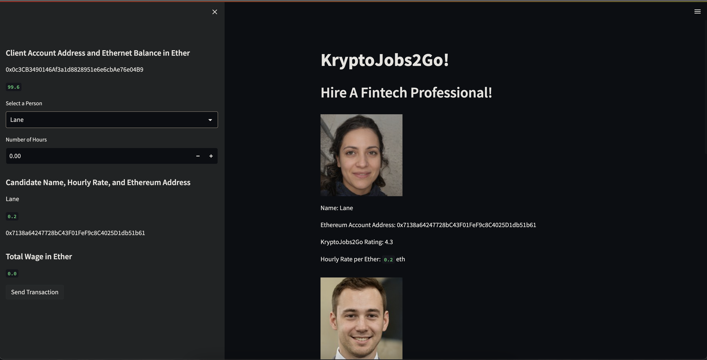

# Cryptocurrency Wallet


You’re a fintech engineer who’s working at one of the five largest banks in the world. You were recently promoted to act as the lead developer on their decentralized finance team. Your task is to build a blockchain-based ledger system, complete with a user-friendly web interface. This ledger should allow partner banks to conduct financial transactions (that is, to transfer money between senders and receivers) and to verify the integrity of the data in the ledger.

## The Application

Lorem ipsum dolor sit amet, consectetur adipiscing elit, sed do eiusmod tempor incididunt ut labore et dolore magna aliqua. Ut enim ad minim veniam, quis nostrud exercitation ullamco laboris nisi ut aliquip ex ea commodo consequat. Duis aute irure dolor in reprehenderit in voluptate velit esse cillum dolore eu fugiat nulla pariatur. Excepteur sint occaecat cupidatat non proident, sunt in culpa qui officia deserunt mollit anim id est laborum.



## Transaction

### Making Transaction

Lorem ipsum dolor sit amet, consectetur adipiscing elit, sed do eiusmod tempor incididunt ut labore et dolore magna aliqua. Ut enim ad minim veniam, quis nostrud exercitation ullamco laboris nisi ut aliquip ex ea commodo consequat. Duis aute irure dolor in reprehenderit in voluptate velit esse cillum dolore eu fugiat nulla pariatur. Excepteur sint occaecat cupidatat non proident, sunt in culpa qui officia deserunt mollit anim id est laborum.


### Transaction on Ganache

Lorem ipsum dolor sit amet, consectetur adipiscing elit, sed do eiusmod tempor incididunt ut labore et dolore magna aliqua. Ut enim ad minim veniam, quis nostrud exercitation ullamco laboris nisi ut aliquip ex ea commodo consequat. Duis aute irure dolor in reprehenderit in voluptate velit esse cillum dolore eu fugiat nulla pariatur. Excepteur sint occaecat cupidatat non proident, sunt in culpa qui officia deserunt mollit anim id est laborum.


Lorem ipsum dolor sit amet, consectetur adipiscing elit, sed do eiusmod tempor incididunt ut labore et dolore magna aliqua. Ut enim ad minim veniam, quis nostrud exercitation ullamco laboris nisi ut aliquip ex ea commodo consequat. Duis aute irure dolor in reprehenderit in voluptate velit esse cillum dolore eu fugiat nulla pariatur. Excepteur sint occaecat cupidatat non proident, sunt in culpa qui officia deserunt mollit anim id est laborum.


Lorem ipsum dolor sit amet, consectetur adipiscing elit, sed do eiusmod tempor incididunt ut labore et dolore magna aliqua. Ut enim ad minim veniam, quis nostrud exercitation ullamco laboris nisi ut aliquip ex ea commodo consequat. Duis aute irure dolor in reprehenderit in voluptate velit esse cillum dolore eu fugiat nulla pariatur. Excepteur sint occaecat cupidatat non proident, sunt in culpa qui officia deserunt mollit anim id est laborum.


Lorem ipsum dolor sit amet, consectetur adipiscing elit, sed do eiusmod tempor incididunt ut labore et dolore magna aliqua. Ut enim ad minim veniam, quis nostrud exercitation ullamco laboris nisi ut aliquip ex ea commodo consequat. Duis aute irure dolor in reprehenderit in voluptate velit esse cillum dolore eu fugiat nulla pariatur. Excepteur sint occaecat cupidatat non proident, sunt in culpa qui officia deserunt mollit anim id est laborum.


## Getting Started

### Prerequisites

Download Ganache [here](https://trufflesuite.com/ganache/)


You must have Python 3 & Pip installed

```
$ python3 --version
Output: Python 3.10.8
$ pip --verison
Ouput: pip 22.2.2 from /Users/{#Username}/opt/anaconda3/lib/python3.9/site-packages/pip (python 3.9)
```

### Installing Dependencies

```
$ pip install streamlit
$ pip install python-dotenv
$ pip install datetime
$ pip install pandas
$ pip install typing
$ pip install dataclasses
$ pip install bip44
$ pip install mnemonic
$ pip install eth-tester
$ pip install web3
$ pip show protobuf
$ pip install --upgrade protobuf
```

### Clone Repository
```
$ git clone git@github.com:SZun/Cryptocurrency-Wallet.git
$ cd PyChain-Ledger
```

### Open Ganache Workspace


### Run The Application
```
$ streamlit run krypto_jobs.py
```

## Built With
[]([https://www.python.org/downloads/release/python-3713/)
[](https://www.python.org/downloads/release/python-3713/) - *Programming Language* <br>
[](https://streamlit.io/) - *Web app generation tool* <br>
[](https://pandas.pydata.org/docs/#) - *Data analysis library* <br>
[Requests](https://requests.readthedocs.io/en/latest/) - *HTTP Library* <br>
[Python-Dotenv](https://github.com/theskumar/python-dotenv) - *Environment variable helper library* <br>
[BIP 44](https://github.com/bitcoin/bips/blob/master/bip-0044.mediawiki) - *Python implementation of bitcoin wallet standard* <br>
[Web3](https://web3py.readthedocs.io/en/v5/) - *A Python library for interacting with Ethereum* <br>

### Python Libraries
- [dataclasses](https://docs.python.org/3/library/dataclasses.html)
- [os](https://docs.python.org/3/library/os.html)
- [typing](https://docs.python.org/3/library/typing.html)


## Contributors
- **Sam G. Zun** - [LinkedIn](https://www.linkedin.com/in/szun/) | [GitHub](https://github.com/SZun)