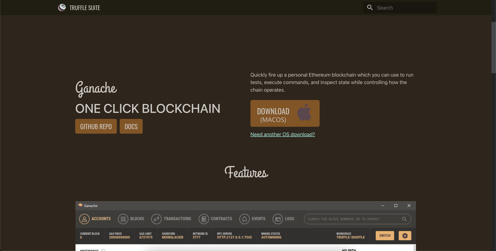

# Cryptocurrency Wallet


You’re a fintech engineer who’s working at one of the five largest banks in the world. You were recently promoted to act as the lead developer on their decentralized finance team. Your task is to build a blockchain-based ledger system, complete with a user-friendly web interface. This ledger should allow partner banks to conduct financial transactions (that is, to transfer money between senders and receivers) and to verify the integrity of the data in the ledger.

## The Application

<!--Below is an image of the application in use. There is a form to record and submit the `Sender`, `Reciever` and `Amount` of the cryptocurrency. Below this we see a public ledger that along with the Genesis block, has recorded several other blocks for transactions. Below the ledger is a button to validate the chain. Once clicked, it will display `True` or `False` depending on the validity of the chain. In the image we see `True` in green text below the button, indicating that the chain is valid. On the left side of the application we see a slider to select the difficulty of tha chain's hash. Below this we have a dropdown to select a specific block from the chain ledger. And below that in green text we see the values of the block.-->


## Transaction

### Making Transaction


### Transaction on Ganache

Sender

Transaction History

Transaction

Reciever


## Getting Started

### Prerequisites

Download Ganache [here](https://trufflesuite.com/ganache/)



You must have Python 3 & Pip installed

```
$ python3 --version
Output: Python 3.10.8
$ pip --verison
Ouput: pip 22.2.2 from /Users/{#Username}/opt/anaconda3/lib/python3.9/site-packages/pip (python 3.9)
```

### Installing Dependencies

```
$ pip install streamlit
$ pip install python-dotenv
$ pip install datetime
$ pip install pandas
$ pip install typing
$ pip install dataclasses
$ pip install bip44
$ pip install mnemonic
$ pip install eth-tester
$ pip install web3
$ pip show protobuf
$ pip install --upgrade protobuf
```

### Clone Repository
```
$ git clone git@github.com:SZun/Cryptocurrency-Wallet.git
$ cd PyChain-Ledger
```

### Run The Application
```
$ streamlit run krypto_jobs.py
```

## Built With
[]([https://www.python.org/downloads/release/python-3713/)
[](https://www.python.org/downloads/release/python-3713/) - *Programming Language* <br>
[](https://streamlit.io/) - *Web app generation tool* <br>
[](https://pandas.pydata.org/docs/#) - *Data analysis library*

### Python Libraries
- [dataclasses](https://docs.python.org/3/library/dataclasses.html)
- [datetime](https://docs.python.org/3/library/datetime.html)
- [hashlib](https://docs.python.org/3/library/hashlib.html)
- [typing](https://docs.python.org/3/library/typing.html)

## Contributors
- **Sam G. Zun** - [LinkedIn](https://www.linkedin.com/in/szun/) | [GitHub](https://github.com/SZun)